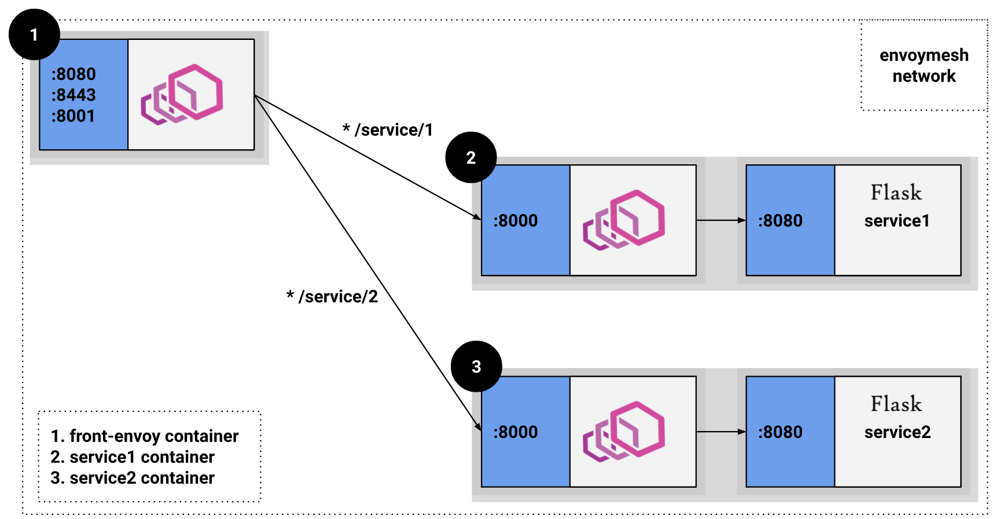

# Envoy Circuit Breaker Demo

This is a demo to experiment with envoy circuit breaker.
The setup is the same as [envoyproxy/envoy's](http://github.com/envoyproxy/envoy) example: [front-proxy](http://github.com/envoyproxy/envoy/tree/master/examples/front-proxy).

## Setup
The setup includes two services behind envoys and there is a front envoy directing traffic to these services.


## Documentation
Envoy has [configuration for circuit breaker](https://www.envoyproxy.io/docs/envoy/latest/api-v2/api/v2/cluster/circuit_breaker.proto) for each cluster:
```
{
  "priority": "...",
  "max_connections": "{...}",
  "max_pending_requests": "{...}",
  "max_requests": "{...}",
  "max_retries": "{...}"
}
```
* `max_connections` is the maximum number of tcp connections the envoy can establish with the upstream cluster. Default is 1024.
* `max_requests` is the maximum number of HTTP requests envoy can make to the upstream cluster. Default is 1024.
* `max_pending_requests` is the maximum number of pending HTTP requests envoy can hold in it's pending queue. Default is 1024.
* `max_retries` is the maximum number of retries to all the hosts in upstream cluster.

Note: The behavior varies depending on the connection between the envoy and the upstream cluster. 
- If the connection is HTTP1.1, `max_connections` config has to be set to the desired number of connections required to the upstream cluster.
- If the connection is HTTP2, `max_requests` config has to be set the desired number of connections required to the upstream cluster.
- `max_pending_requests` is honored only in HTTP1.1 connections. HTTP2 requests are not queued.

This is because HTTP2 multiplexes multiple requests over the same tcp connection.

[Here](https://www.envoyproxy.io/docs/envoy/latest/intro/arch_overview/circuit_breaking) is the detailed explanation for these configs.


## Usage
* Clone the repo.
* `cd front-proxy`
* Start the docker containers:

    `docker-compose build`

    `docker-compose up`

#### Service 1 HTTP1.1 testing:
[Config](front-proxy/front-envoy.yaml#L37): 
```
clusters:
  - name: service1
    circuit_breakers:
      thresholds:
      - priority: DEFAULT
        max_connections: 3
        max_pending_requests: 1
```

* Start 3 connections to service 1:

    `./connections.sh 1 3`
* See the circuit-breaker trip:

    `curl -s localhost:8081/stats | grep service1.circuit_breakers.default`
    ```
    cluster.service1.circuit_breakers.default.cx_open: 1
    cluster.service1.circuit_breakers.default.rq_open: 0
    cluster.service1.circuit_breakers.default.rq_pending_open: 0
    cluster.service1.circuit_breakers.default.rq_retry_open: 0
    ```

* Try to establish another connection and see the pending flag flip:

    `./connection.sh 1`

    `curl -s localhost:8081/stats | grep service1.circuit_breakers.default`
    ```
    cluster.service1.circuit_breakers.default.cx_open: 1
    cluster.service1.circuit_breakers.default.rq_open: 0
    cluster.service1.circuit_breakers.default.rq_pending_open: 1
    cluster.service1.circuit_breakers.default.rq_retry_open: 0
    ```

* Try to establish yet another connection and see the envoy fast fail:

    `./connection.sh 1`
    ```
    HTTP/1.1 503 Service Unavailable
    content-length: 57
    content-type: text/plain
    x-envoy-overloaded: true
    date: Mon, 24 Dec 2018 19:15:30 GMT
    server: envoy
    connection: close

    upstream connect error or disconnect/reset before headers%
    ```

#### Service 2 HTTP2 testing:
[Config](front-proxy/front-envoy.yaml#L50): 
```
clusters:
  - name: service2
    http2_protocol_options: {}
    circuit_breakers:
      thresholds:
      - priority: DEFAULT
        max_requests: 3
```

* Start 3 connections to service 2:

    `./connections.sh 2 3`
* See the circuit-breaker trip:

    `curl -s localhost:8081/stats | grep service2.circuit_breakers.default`
    ```
    cluster.service2.circuit_breakers.default.cx_open: 0
    cluster.service2.circuit_breakers.default.rq_open: 1
    cluster.service2.circuit_breakers.default.rq_pending_open: 0
    cluster.service2.circuit_breakers.default.rq_retry_open: 0
    ```

* Try to establish another connection and see the envoy fast fail:

    `./connection.sh 2`
    ```
    HTTP/1.1 503 Service Unavailable
    content-length: 57
    content-type: text/plain
    x-envoy-overloaded: true
    date: Mon, 24 Dec 2018 19:23:12 GMT
    server: envoy
    connection: close

    upstream connect error or disconnect/reset before headers%
    ```
